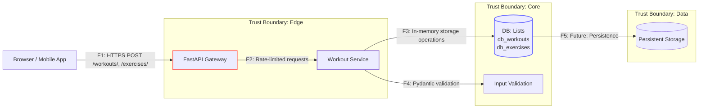

# Data Flow Diagram для Workout Log API

Диаграмма потоков данных (DFD) с обозначенными границами доверия и потоками для сервиса отслеживания тренировок. Отражает требования безопасности из NFR-02 (защита данных) и NFR-05 (защита от DoS).

